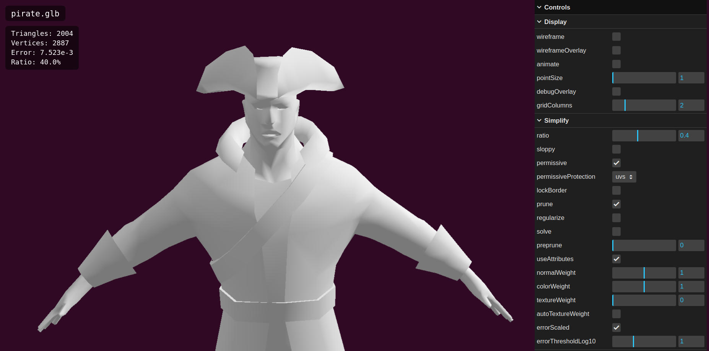
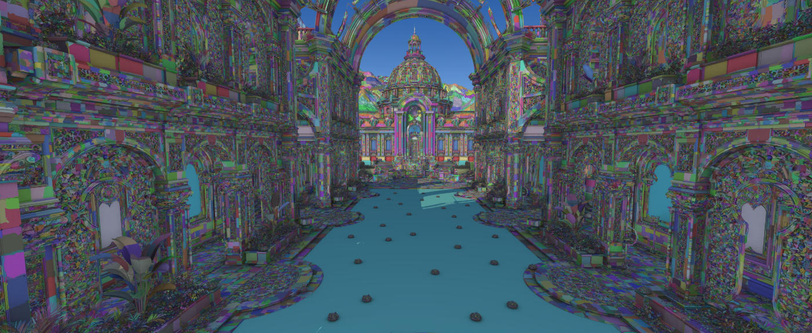
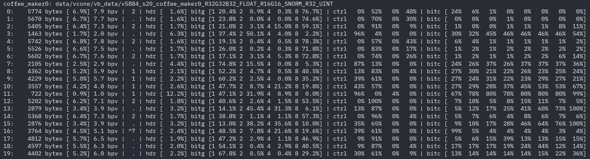

meshoptimizer is a mesh optimization library that makes meshes smaller and faster to render. It's permissively licensed under MIT and widely used [across the industry](https://github.com/zeux/meshoptimizer/discussions/986). Today, a little over nine years since the [first commit](https://github.com/zeux/meshoptimizer/commit/58bd2b3b7bfaf46237055af0a4813491b26777de), it has reached the first [major version, 1.0](https://github.com/zeux/meshoptimizer/releases/tag/v1.0).

The library itself is structured as a diverse collection of algorithms that target different parts of the graphics pipeline and different aspects of efficiency: reducing redundancy in mesh representations, reducing mesh complexity, storage compression and optimizing for efficiency of various hardware units. Not all renderers would use all the algorithms, but it's rare to find a renderer that doesn't benefit from at least some. Other aspects of the library design, such as the minimal build structure and focus on high performance, make it a good choice for most engine content pipelines -- as long as they use triangle meshes, that is (although the library also supports some algorithms designed for point clouds!).

In addition to the library, another project, [gltfpack](https://meshoptimizer.org/gltf), is developed and distributed alongside it. This is an opinionated command-line tool that can take a glTF file and perform full-scene optimization, eliminating redundant elements, simplifying glTF structure and compressing the data if requested. `gltfpack` is intentionally only supporting the core specification as well as a set of Khronos extensions, so it may not always be a good fit for complex glTF pipelines that rely on custom extensions - but for pipelines that rely on this subset, it aims to provide a fast and easy to use preprocessing tool.

Finally, as of this release, a new single-header library, [clusterlod.h](https://github.com/zeux/meshoptimizer/blob/master/demo/clusterlod.h), is developed and maintained alongside the library. This library implements continuous level of detail by generating a hierarchy of clusters that are progressively grouped and simplified, similarly to Nanite. It leverages meshoptimizer algorithms for internal processing, and can either be used as-is or as a starting point for implementing a custom solution - the code is structured to be easy to understand and modify. Some relevant improvements are described in the [Billions of triangles in minutes](https://zeux.io/2025/09/30/billions-of-triangles-in-minutes/) blog post.

If you'd like to read the full release notes, get the source code or browse the repository further, [the GitHub release](https://github.com/zeux/meshoptimizer/releases/tag/v1.0) is a good starting point. Additionally, reading the [reference manual](https://meshoptimizer.org/) hosted on this site is highly recommended; it goes into many details around various algorithms, including usage examples and additional insight about when and how to use them best.

In the rest of this post, we'll talk a little more about recent changes in meshoptimizer as well as what "1.0" really means going forward.

## Release highlights

This release focuses on improvements to clusterization, simplification and partitioning algorithms, as well as stabilization - with the exception of permissive simplification mode, all other library functionality introduced in prior releases is now considered stable.

Clusterization algorithms (`meshopt_buildMeshlets`, `meshopt_buildMeshletsFlex`, `meshopt_buildMeshletsSpatial`) are now faster and, in the case of spatial clusterization, produce higher-quality clusters for vertex-bound meshlets. Additionally, meshlet builders no longer align local index data to 4 bytes, which simplifies memory management and removes alignment restrictions on triangle limits. When cluster partitioning is required, `meshopt_partitionClusters` now produces better partitioning for disconnected clusters which improves quality of DAGs for hierarchical clusterization.

As mentioned above, starting from this release, a single-header library [clusterlod.h](https://github.com/zeux/meshoptimizer/blob/master/demo/clusterlod.h) is developed and maintained alongside meshoptimizer. This is separate from the main library for a few reasons. High level algorithms like this one tend to be highly opinionated and difficult to generalize; the code is designed to be easy to read and modify, so if some particular details don't fit your use case or you'd like to replace parts of this code, it should be easy enough to do. The code can also be used as-is, and it provides a wide set of configuration options - however, this is an area that is quickly evolving, and it's difficult to provide the same API stability guarantees as the main library.

New simplification features added in the last release have seen further quality improvements as well; both `meshopt_simplifyWithUpdate` and the `meshopt_SimplifyPermissive` option now generate higher-quality outputs. Permissive mode option specifically is still considered experimental, and future releases may improve or change behavior further.

All other experimental library functions and options have been promoted to stable status. This means that future releases will be API compatible (code will continue compiling), ABI compatible (code can link to a shared library build of meshoptimizer which can then be updated independently) and behavior compatible (results may improve in future releases, but these improvements should not require adjustments to the calling code) as far as current 1.0 functionality is concerned.

Early this year, vertex codec v1 was added as an optional update, which supported increased compression ratio for vertex data and faster decompression speed. Starting from v1.0, the vertex encoding functions (`meshopt_encodeVertexBuffer`) now encode v1 data by default. This can be overridden for applications that need to produce data in v0 format, especially when targeting the glTF `EXT_meshopt_compression` extension which only supports v0. This release only switches the encoding defaults; support for encoding and decoding v0/v1 will be provided in perpetuity.

`gltfpack` now supports the new [KHR_meshopt_compression](https://github.com/KhronosGroup/glTF/pull/2517) extension via `-cz` option (or `-ce khr` which allows specifying compression level independently; `-cz` is equivalent to `-ce khr -cc`), which provides better compression compared to the existing `EXT_meshopt_compression` extension. Note that loader support for this extension is not yet widely available, so gltfpack continues to use `EXT_meshopt_compression` by default when compression is requested.

Finally, [JavaScript bindings](https://www.npmjs.com/package/meshoptimizer) have been updated to use ES modules instead of CommonJS modules, which may require adjustments to import paths. For the MeshoptDecoder module, a CommonJS variant `meshopt_decoder.cjs` is still provided for compatibility (but note a different file extension, required for correct handling by some bundlers).

## Looking back

This is the fourth release this year; as such, it may be difficult to appreciate the v1.0 updates in isolation - a lot of the library functionality that was stabilized in v1.0 was added in one of the prior releases. From that perspective, it could be helpful to look at the last two years of library development and ask: what is new?

In some sense, two years back is an arbitrary date; but it's meaningful, as this approximately coincides with the library author having [much more time](https://zeux.io/2024/12/31/year-of-independence/) to dedicate to further improvements, and, for some of this time, Valve graciously agreeing to sponsor some areas of library development. As a result, meshoptimizer has seen increased development velocity over the last two years, and, hopefully, the results show.

For each area of the library as well as `gltfpack` there's been a series of improvements, big and small; here are some highlights.

### Simplification

For mesh simplification, two years ago the library mostly provided simplification algorithms that were not attribute-aware; the quality could be reasonable in some cases but was often underwhelming, especially since shading quality of levels of detail could be visibly off. Now, the main simplification algorithm has [robust attribute support](https://meshoptimizer.org/#attribute-aware-simplification) and can also optionally be used to [optimize the resulting positions and attributes](https://meshoptimizer.org/#simplification-with-vertex-update) for highest quality.

Because the simplification algorithm followed original topology closely, it would get severely restricted by excessive attribute discontinuities; some meshes, notably ones with faceted shading, could not be simplified at all without some pre-processing steps that would degrade appearance. While this feature is not stable yet, [permissive simplification](https://meshoptimizer.org/#permissive-simplification) lifts this restriction, while providing enough control to protect individual discontinuities when necessary. 

These additions above represent the main "modes" the simplifier can now work in (with or without attribute data; with or without update; optionally, with permissive mode on top), but it also gained a lot of extra functionality that can be enabled by just adding an option flag.

For example, when permissive simplification is not used, it's still possible to improve the simplification results by using component pruning via `meshopt_SimplifyPrune`; it removes individual small disconnected parts of the mesh regardless of their topology, and that process is integrated with the main simplification flow. Or, to balance the final appearance with tessellation quality (important for deformable meshes and for raytracing performance), `meshopt_SimplifyRegularize` produces more uniform triangles at some tradeoff to appearance/triangle count.

### Clusterization

Over the last two years, the support for cluster based rendering algorithms has improved significantly. The main clusterization algorithm, `meshopt_buildMeshlets`, had many internal improvements and now also exposes additional control over the tradeoff between memory utilization and spatial coherence (which requires a few more arguments and a new function `meshopt_buildMeshletsFlex`, to keep the existing code working). However, a new alternative algorithm, `meshopt_buildMeshletsSpatial`, that is maximizing the quality of spatial splits (measured via surface-area heuristic) is now available too - this algorithm is especially useful when splitting meshes into clusters that are going to be used for raytracing, for example by utilizing NVIDIA's new [clustered raytracing extensions](https://docs.vulkan.org/features/latest/features/proposals/VK_NV_cluster_acceleration_structure.html).

Similarly to mesh rendering, it also turned out that, for some GPUs, the order of triangles and vertices in each meshlet [matters](https://zeux.io/2024/04/09/meshlet-triangle-locality/). A separate algorithm, `meshopt_optimizeMeshlet`, can now be used to quickly optimize individual meshlets for locality - in addition to rasterization performance, this can also help in raytracing workloads when using build time optimized BVH construction.

In some renderers, splitting a mesh into clusters is enough; however, approaches like Nanite require support for hierarchical clustering, where clusters are progressively grouped into larger structures, with this grouping being optimized for spatial and topological coherence. A new [partitioning algorithm](https://meshoptimizer.org/#cluster-partitioning) is provided for this purpose as well.

Together, between these improvements and some other supporting code in other library algorithms, it's now possible to implement complex hierarchical LOD pipelines using meshoptimizer algorithms. As mentioned earlier, `clusterlod.h` is built to make starting here easier. Of course, meshoptimizer algorithms only help support data generation here which, at best, is half of the story; if you're looking for a full fledged end-to-end application of these ideas, [NVIDIA vk_lod_clusters](https://github.com/nvpro-samples/vk_lod_clusters) example is open-source, comes with example assets and implements many advanced techniques like streaming, compute rasterization, etc.

### Compression

Since 2018, the library has supported [special purpose compression](https://meshoptimizer.org/#mesh-compression) of vertex and index data; in contrast to general purpose compression, the codecs provided by the library are designed to take advantage of redundancies inherent in geometric data stored in runtime-friendly and engine-specific formats, but simultaneously to provide incredibly fast decoding - targeting gigabytes per second of decode throughput on modern hardware. This makes it practical to use these to compress meshes even when the meshes are loaded from fast storage (modern SSDs support gigabytes per second of read bandwidth!). In addition, the codecs produce data that could be compressed further by general purpose compression like Zstandard; pre-compressing the data can reduce the sizes below what general purpose compression can do alone and, for slower decompressors like Zstandard, improve the decoding performance by reducing the amount of work the general purpose decompression has to do.

In 2021, a slightly improved version of the codecs made it into glTF standard as `EXT_meshopt_compression` extension; however, progress since then has been limited, with occasional optimizations here and there, because the bitstream format was restricting the efficiency of vertex data in particular.

Today, the vertex codec has been revised within the same design constraints - fast decoding, outputs could be compressed further if desired, support game engine-ready vertex formats - but pushed further with an enhanced bitstream design that allows to take better advantage of data redundancy and gives the encoder more freedom - the v0 design was mostly symmetric in the sense that for a given data input, there was only one way to encode it; v1 design adds encoder-selectable modes at various levels in the encoding hierarchy that help the encoder to adapt the compressed stream for the patterns found in the encoded data.

As a result, the v1 encoder produces, depending on the input structure, ~10% smaller encoded outputs; and, perhaps unexpectedly, usually decodes these as fast or faster than the original decoder. In addition to that, more architecture specific optimizations have been implemented, which increases the decoding throughput even further; on Apple M4, the current v1 decoder is up to 30% faster than the two-year-old v0 decoder, and exceeds 5 GB/s on densely packed engine ready vertex data.

While these updates have not fully made it into glTF, a new [KHR_meshopt_compression](https://github.com/KhronosGroup/glTF/pull/2517) extension is in the process of being finalized; this extension also incorporates further work on [vertex filters](https://meshoptimizer.org/#vertex-filters) that are mostly useful for glTF (as they require a particular structure of the decoded attribute data, which is general but often isn't the most efficient approach a particular game engine might take); vertex filters also saw significant optimizations with 10-50% faster decoding depending on the filter and target platform, and a new filter optimized for RGBA color data.

### gltfpack

In the last two years, the bulk of gltfpack improvements have been a byproduct of the core library improvements. gltfpack does not have a corporate sponsor, and as such it's more difficult to justify improvements and they happen more sporadically.

That said, even the core library updates are pretty significant (for example, when asked to simplify meshes, gltfpack now uses attribute aware simplification with pruning by default, which produces higher quality results). As mentioned above, gltfpack now also has initial support for `KHR_meshopt_compression` when requested.

When it comes to texture processing, gltfpack now supports WebP texture encoding (using `libwebp`; note that official gltfpack builds compile that in, but if you get a release via a different package manager it may not have the requisite support enabled during compilation), has more granular options for texture compression and will preserve compressed textures in the input files correctly, which makes it easier to integrate into complex glTF processing pipelines.

In addition, gltfpack has seen a lot of small fixes and improvements in geometry and material optimization; they are too numerous to list, but of note is automatic deduplication of geometry data, improvements to mesh reindexing with poor input normal structure, and better filtering of unused inputs, which together can reduce the geometry data significantly in some cases.

## Looking forward

Version 1.0 is an important milestone. It's the first major release of the library and it represents a certain point of stability and robustness across a wide array of functionality, that felt significant enough to recognize. It's about time for a proud version bump.

That said, 1.0 is also just a number. Not all details about the future plans are known; and some are not quite ready to be discussed. But what is clear is that after 1.0, there will be 1.1, and 1.2 after that - the library evolution continues.

For the last 9 years, the library has followed the same development methodology: new functionality is introduced as [experimental](https://meshoptimizer.org/#experimental-apis), iterated upon in subsequent releases with the help of the feedback from the community, and eventually marked as stable - which means upgrading the library is safe and uneventful as long as no experimental functionality is used. 1.0 is mostly not a departure in that sense either: for the native library, the only minor compatibility risk is around some edge cases with respect to meshlet index data encoding, and the switch to vertex data v1 by default. Compatibility is very high on the list of priorities for meshoptimizer, and as such it's unlikely that there will be a 2.0 any time soon; no stable functionality is removed and no user is left behind[^1].

None of the three main directions over the past 2 years (simplification, clusterization, compression) are fully done yet. Each is much further along than it used to be, but simplification can still use more quality improvements, compression doesn't support meshlets, and considering the rate of change over the last month or two, `clusterlod.h` will see a lot of tweaks going forward. That said, it's very likely that new interesting directions are going to emerge as well. The author is mulling over some ideas but any and all feedback is appreciated; feel free to [e-mail thoughts](mailto:arseny.kapoulkine@gmail.com) and suggestions, although "thank you, we use meshopt in this game" notes are also appreciated ;)

To everyone who has contributed to meshoptimizer or built projects upon it in the past: thank you. Open-source projects thrive to the extent they are used and are useful; that fuels motivation and makes the author happy. Looking forward to the first decade of meshoptimizer and beyond!

> The majority of the work on the core library in this release has been sponsored by Valve. Some of the work mentioned above also benefited from discussions and prototypes by NVIDIA engineers. Thank you!

[^1]: With the notable exception of removal of CommonJS support for most of the JavaScript bindings, but that's what major versions are for in the Web ecosystem right?..
